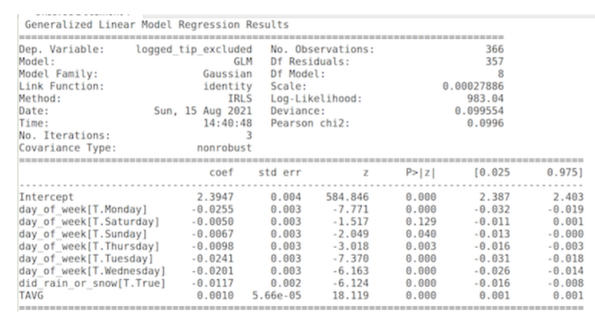
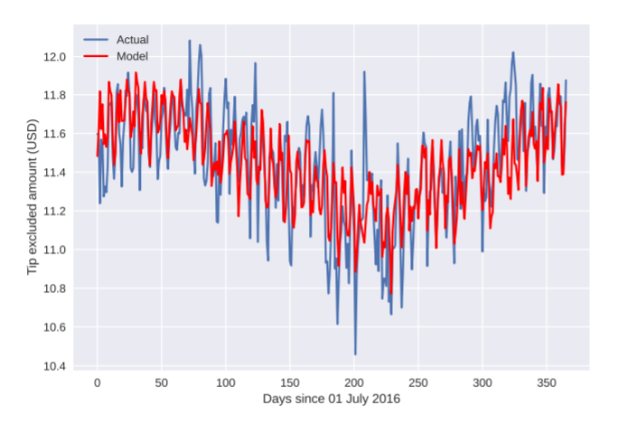

# Introduction
It is no secret that New York is a highly dense and populated city. To match the extremely busy nature
of the city, many forms of transportation are available such as the underground subway or buses. Most
importantly, the yellow and green taxis that are prevalent throughout the city are symbolic to the
New York experience. This project is designed to help taxi drivers in predicting their daily income using
statistical modelling

# Table of Contents

1. [Introduction](#introduction)
2. [Goal](#goal)
3. [Datasets](#datasets)
4. [Preprocessing](#preprocessing)
5. [Feature Engineering](#feature-engineering)
6. [Analysis](#analysis)
   - [Univariate Analysis](#univariate-analysis)
   - [Multivariate Analysis](#multivariate-analysis)
   - [Geospatial Visualization](#geospatial-visualization)
7. [Statistical Modelling](#statistical-modelling)
8. [Model Evaluation](#model-evaluation)
9. [Dependencies](#dependencies)
# Goal
The general, underlying driving questionnaire behind this project is ”How can a green taxi driver
roughly estimate the overall income of a day just before it begins?”.

While this question may appear simple or elementary, to answer, we must view life from the lens of
a taxi driver in New York City. Most taxi drivers do not have access to devices that magically pair
them with the highest paying customers. In general, they roam around populated areas of the city
and pick up passengers who need a ride. As such, information they have available to anticipate their
profits are quite limited from a realistic perspective.

# Datasets
- NYC TLC: https://www1.nyc.gov/site/tlc/about/tlc-trip-record-data.page
- Climate Data: https://www.ncdc.noaa.gov/cdo-web/


# Preprocessing
The green taxi data was first cleaned based on the information available on NYC taxi fares. Due to
the large quantity of taxi rides, numerous errors were induced by technical or man made mistakes.
The following instances were cleaned:<br>
• Only payment types made by card or credit (1 or 2) were considered as it took up majority of
the payments and the other types did not follow a predictable format
```python 
green = green.loc[(green["VendorID"] == 1) | (green["VendorID"] == 2)]
```
• Fare amounts less than $2.50 were removed as the flat fee meant a minimum cost for every ride
```python 
green = green.loc[green["Fare_amount"] >= 2.5]
```
• VendorID that was not 1 or 2 were removed as they were invalid LPEP providers
```python 
green = green.loc[(green["VendorID"] == 1) | (green["VendorID"] == 2)]
```
• Tip excluded amount was limited to values between $0 and $100 which removed extreme outliers
```python 
green = green.loc[(green["tip_excluded"] > 0) & (green["tip_excluded"] < 100)]
```
• Trip distances greater than 200 were removed as there were very few extreme instances
```python 
green = green.loc[(green["Trip_distance"] > 0) & (green["Trip_distance"] < 200)]
```
• For tip excluded amount and trip distances, many valid points existed which were still outside
region pay per mile values greater than 30 were remove 
```python 
green["pay_per_mile"] = green["tip_excluded"]/green["Trip_distance"]
green = green.loc[green["pay_per_mile"] < 30]
```
• Only longitude and latitude taxi ride pick ups within the New York City range were included
```python 
green = green.loc[(-74 < green['Pickup_longitude'] ) & (green['Pickup_longitude'] < -73.7) &  (40.48 < green['Pickup_latitude']) & (green['Pickup_latitude'] < 41)]
```

# Feature Engineering
• tip excluded, the total payment paid by customer minus the tip
```python 
green = green.loc[(-74 < green['Pickup_longitude'] ) & (green['Pickup_longitude'] < -73.7) &  (40.48 < green['Pickup_latitude']) & (green['Pickup_latitude'] < 41)]
```
• pay per mile, created for invalid data identification. Tip was excluded in calculation.
```python 
green["pay_per_mile"] = green["tip_excluded"]/green["Trip_distance"]
```
Regarding outliers, many of high values of tip excluded or trip distance were still valid points for long
duration or long distance taxi rides. As such, the engineered variable and pay per mile was utilised to
remove data with mismatching trip distance and tip excluded amount. Pay per miles over $30/mile
were cleaned.
Trip distance was right skewed thus a log transformation was applied to values for standardisation.
While most values lied between 0 and 25, many high values outlying data were still valid distances.
As such, the pay per mile variable was utilised to remove invalid points.

# Analysis
## Univariate Analysis
The tip excluded amount is clearly right skewed as shown in Figure 1. As such, a log transformation
was applied which resulted in a more Gaussian, even distribution Figure 2. While most values were
less than 60, values greater than that were still valid and only invalid points were removed with the
pay per mile variable previous.<br>
  
*Figure 1*

  
*Figure 2*

Figure 3 and Figure 4 depict that trip distance was right skewed thus a log transformation was applied
for standardisation. While most values lied between 0 and 25, many high values outlying data were
still valid distances. As such, the pay per mile variable was utilised to remove invalid points.
<div style="display: flex; flex-direction: row; justify-content: space-between;">
    <div style="flex: 1; text-align: center;">
        
        <p>Figure 3</p>
    </div>
    <div style="flex: 1; text-align: center;">
        
        <p>Figure 4</p>
    </div>
</div>


The distribution for rain and snow were both stacked significantly at 0 (days with no rain or snow).
As such, inputting this variable during linear regression could raise problems with linear regression.
Additionally, days in which snow came were very few and always coexisted with precipitation. As
such, both variables were combined into a single to categorical binary variable (did it rain or snow).
Daily average temperature approximately followed a normal distribution, so no transformation was
applied. The transformed values were utilised for more appropriate regression and standardisation of
data.

## Multivariate Analysis
As each of the explanatory variables are constant for each day, the average of each of the response
variables per day will be used during modelling. As such, this resulted in 366 points of data representing
the number of days between 01 July 2015 and 30 June 2016.
Firstly, average temperature for each day appears to quite significantly correlated with tip excluded
amount and trip distance. Figure 6 and Figure 7 suggests strong linear relationship between this
3 explanatory variables and the two response variables respectively, especially strong with the tip excluded
amount. Investigating this further with Figure 8 demonstrates the strong correlation between the two
variables. Across the entirety of the year, both variables trend very tightly together.

<div style="display: flex; flex-direction: row; justify-content: space-between;">
    <div style="flex: 1; text-align: center;">
        
        <p>Figure 6</p>
    </div>
    <div style="flex: 1; text-align: center;">
        
        <p>Figure 7</p>
    </div>
    <div style="flex: 1; text-align: center;">
        
        <p>Figure 8</p>
    </div> 
</div>
While higher temperatures appear to be heavily correlated with higher tip excluded amounts and trip
distances, it has a weak to near zero correlation with the number of taxi trips.
As shown in Figure 9, days that rain or snow seem to reduce the average tip excluded amounts
customers pay. Figure 10 also suggests rain and snow had a small effect on the number of taxi rides
in a given day.
<div style="display: flex; flex-direction: row; justify-content: space-between;">
    <div style="flex: 1; text-align: center;">
        
        <p>Figure 9</p>
    </div>
    <div style="flex: 1; text-align: center;">
        
        <p>Figure 10</p>
    </div>
</div>
Meanwhile, the day of the week appears to have an effect on the tip excluded amount and number of
trips. Figure 11 and Figure 12 demonstrates this as different days of the weak have quite varying levels
of each variable. Especially, the average number of trips per day seems to be very strongly correlated
with day of the week. Almost 1.5x the average number of taxi rides occur on Saturday as opposed to
Monday.
<div style="display: flex; flex-direction: row; justify-content: space-between;">
    <div style="flex: 1; text-align: center;">
        
        <p>Figure 11</p>
    </div>
    <div style="flex: 1; text-align: center;">
        
        <p>Figure 10</p>
    </div>
</div>
While the amount earned and travelled on average for each trip appears to increase with higher
temperatures, the number of taxi rides doesn’t appear to be effected as no real correlation or trend is
evident.

## Geospatial Visualisation
Figure 13 depicting the pickups in NYC on Saturday. With this map in mind, the next Figure 14
compares the distribution of pickups on the two highest and lowest taxi ride counting days of the
week. Despite the differing frequency of taxi rides in both days of the week, the general pick-up trends
across the city seem to show a similar spatial pattern. People tend to catch taxis in similar locations
regardless of day of week while the frequency differs substantially
<div style="display: flex; flex-direction: row; justify-content: space-between;">
    <div style="flex: 1; text-align: center;">
        
        <p>Figure 13</p>
    </div>
    <div style="flex: 1; text-align: center;">
        
        <p>Figure 14</p>
    </div>
</div>

# Statistical Modelling
The attribute we will be predicting is the mean of the log transformed tip excluded amount. As
temperature is not correlated with the frequency of taxi rides, it only leaves two categorical variables
responsible for predicting this response variable (rain or snow, day of week) which is most likely
insufficient. Secondly, while trip distance can adequately be predicted, it is heavily correlated with
tip excluded amount anyway meaning it isn’t worth applying two models. Based on the calculation of
taxi fares and the primacy of this study being centred around the profit of green taxis, this decision
was made.<br>

The model we will be implementing is Generalised Linear Model (3). There are two primary reasons
for this. Firstly, as seen above, temperature appears to have a very strong linear relationship with tip
excluded amount. Furthermore, the two categorical variables (rain or snow, day of week) can also be
included within this model (while linear regression is not possible).<br>


Feature selection was commenced through forward stepwise AIC selection. Below is a brief summary
to how the final model was generated.<br>

1. AIC = -1643 for the model, T IE ∼ constant,
2. AIC = -1829 for the model, T IE ∼ T AV G,
3. AIC = -1666 for the model, T IE ∼ RainOrSnow,
4. AIC = -1686 for the model, T IE ∼ DOW,
5. AIC = -1858 for the model, T IE ∼ T AV G + RainOrSnow,
6. AIC = -1913 for the model, T IE ∼ T AV G + DOW,
7. AIC = -1948 for the model, T IE ∼ T AV G + DOW + RainOrSnow,
<br>

where T IE is daily average of log-transformed tip excluded amount, T AV G is daily average temperature,
RainOrSnow is the binary value of rain or snow, DOW is day of week.
Hence, the final model is fitted upon daily average temperature, day of week and rain or snow (binary)
to predict tip excluded amount.

# Model Evaluation
Figure 16 shows the result of the modelling fitting. Figure 17 demonstrates how effectively the model
as fitted to the training data. While the variation in the true data appear to be slightly wider, the
prediction scores follow quite closely to the overall trend of the real training data.
For prediction, the next slot of a year’s worth of data from 01 July 2016 to 31 June 2017 was predicted
from the model fitted. Figure 18 depicts how closely predicted values by the trained model follows the
true values of the test data. While the general direction of the predictions resembles the true values,
it performed quite poorly with a R-squared score of -0.0443.
<br>
As predictions matched the real values of the trained data, but poorly against new data, this could
indicate the existence of overfitting to the training data. Additionally, investigating the test data
predictions shows that the true tip excluded performed worse with lower values of tip excluded (higher
residuals). In Figure 15, the real tip excluded amounts in the test data followed similarly with higher
values but dipped lower than the training data did while having similar temperature values.
<br>
Especially as overfitting is suspected to have occurred, it appears as though the model was incapable of
making sense of why the lower dip in tip excluded amount occurred based on the explanatory variables
it can work with. This heavily implies there are vital explanatory variables we have not considered or
there may not be a non-linear relationship between the variables explored.

<div style="display: flex; flex-direction: row; justify-content: space-between;">
    <div style="flex: 1; text-align: center;">
        
        <p>Figure 15</p>
    </div>
    <div style="flex: 1; text-align: center;">
        
        <p>Figure 16</p>
    </div>
    <div style="flex: 1; text-align: center;">
        
        <p>Figure 17</p>
    </div> 
</div>

# Dependencies
- Language: _i.e Python 3.8.3 and/or R 4.05_
- Packages / Libraries: _i.e pandas, pyspark, sklearn, statsmodels, folium, numpy, matplotlib, scipy, warnings, datetime, glmnet, seaborn
